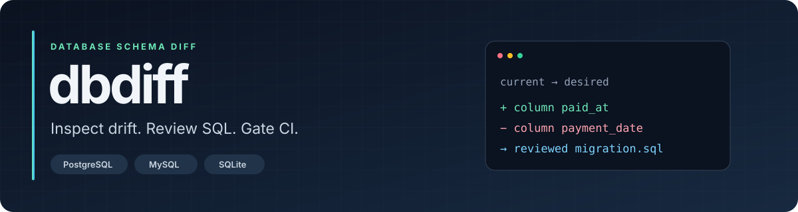
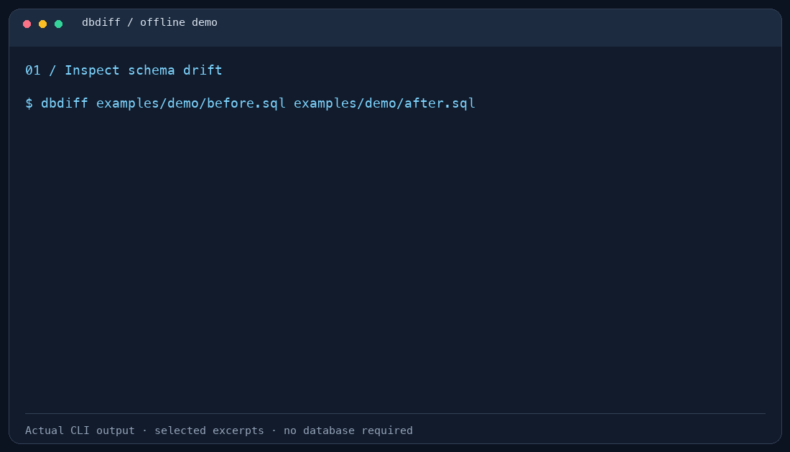

<p align="center">
  
</p>

<p align="center">
  <a href="https://github.com/rekurt/dbdiff/actions/workflows/ci.yml"></a>
  <a href="https://github.com/rekurt/dbdiff/releases"></a>
  <a href="https://www.rust-lang.org"></a>
  <a href="LICENSE"></a>
</p>

<p align="center">
  <strong>Compare database schemas. See what changed. Generate SQL you can review.</strong><br>
  PostgreSQL · MySQL / MariaDB · SQLite · SQL files · JSON snapshots
</p>

<p align="center">
  <a href="#try-the-demo">Try the demo</a> ·
  <a href="#install">Install</a> ·
  <a href="doc/cli.md">CLI guide</a> ·
  <a href="https://rekurt.github.io/dbdiff/">Website</a> ·
  <a href="CONTRIBUTING.md">Contribute</a>
</p>

## See it in action



*[Static preview](doc/assets/demo.png). Excerpts from the offline demo below, captured from the actual CLI. The full run also verifies JSON output, migration files, rollback SQL, and preview behavior.*

- **Find drift before a deploy:** compare current and desired schemas from files or live databases.
- **Review the migration:** see generated SQL, destructive-operation warnings, and a rollback plan.
- **Gate your pipeline:** machine-readable reports and explicit exit codes for drift and blocking operations.
- **Work offline:** compare SQL files or export a JSON snapshot for later review.

`dbdiff` generates migration SQL; it does **not** execute that SQL against your database.

## Try the demo

No database server, credentials, or Docker required. From a checkout:

```bash
git clone https://github.com/rekurt/dbdiff.git
cd dbdiff
cargo build --locked
python3 examples/demo/run.py --bin target/debug/dbdiff
```

Requires Rust 1.88+ and Python 3.9+. On Windows, use `python` and `target/debug/dbdiff.exe`.

The demo replaces a free-form payment date with a timestamp, adds an index, and introduces soft deletion. It verifies four changes and the CI exit codes **1 → 3 → 0**, then saves the transcript, JSON report, forward migration, and rollback under `target/demo/`.

Or, with `dbdiff` installed, run the comparison directly:

```bash
dbdiff examples/demo/before.sql examples/demo/after.sql
```

<details>
<summary>Expected diff (excerpt)</summary>

```text
~ table: orders
  + column  paid_at              timestamp
  - column  payment_date         text
  + index   idx_orders_paid_at ON orders(paid_at)

~ table: users
  + column  deleted_at           timestamp
```

The full output includes unchanged columns, migration SQL, warnings, a summary, and next steps.

</details>

See the [demo walkthrough](examples/demo/README.md) for individual commands and how to regenerate the animation.

## Install

### Release binaries

Download the archive for your platform from [Releases](https://github.com/rekurt/dbdiff/releases), extract it, and put `dbdiff` (or `dbdiff.exe`) on your `PATH`.

| Platform | Archive target |
| --- | --- |
| Linux x86_64 | `x86_64-unknown-linux-gnu` or `x86_64-unknown-linux-musl` |
| Linux ARM64 | `aarch64-unknown-linux-gnu` |
| macOS Intel | `x86_64-apple-darwin` |
| macOS Apple Silicon | `aarch64-apple-darwin` |
| Windows x86_64 | `x86_64-pc-windows-msvc` |

### Build from source

```bash
cargo install --git https://github.com/rekurt/dbdiff --locked
```

All three database backends are enabled by default. For a smaller build:

```bash
cargo install --git https://github.com/rekurt/dbdiff --locked \
  --no-default-features --features postgres,sqlite
```

Source builds require Rust 1.88+ and the platform's build tools; PostgreSQL/MySQL builds may also require TLS development libraries. See [CONTRIBUTING.md](CONTRIBUTING.md).

## Everyday usage

### Compare current → desired

The **first source is the current schema**. The **second source is the desired schema**. Forward SQL changes the first to match the second.

```bash
# Two live PostgreSQL databases
dbdiff "$CURRENT_DSN" "$DESIRED_DSN"

# Live database versus a complete desired schema file
dbdiff "$CURRENT_DSN" --schema schema.sql

# MySQL / MariaDB (both variables contain mysql:// or mariadb:// DSNs)
dbdiff "$MYSQL_CURRENT_DSN" "$MYSQL_DESIRED_DSN"

# SQLite database versus a schema file
dbdiff app.db --schema schema.sql

# Two SQL files, fully offline
dbdiff current.sql desired.sql
```

A schema file should describe the **complete desired structure with CREATE statements**, rather than an incremental ALTER migration. Compare like-for-like database backends; a SQL file can be used on either side. SQL-file-only comparisons generate PostgreSQL-style migration SQL.

### Preview, then save

```bash
# Preview only: this does not create migration.sql
dbdiff current.sql desired.sql --out migration.sql

# Explicitly save the forward migration
dbdiff current.sql desired.sql --emit migration.sql

# Equivalent write command
dbdiff current.sql desired.sql --out migration.sql --write

# Save a separate rollback plan
dbdiff current.sql desired.sql --direction down --emit rollback.sql
```

Review generated SQL before applying it. A rollback restores schema definitions; it cannot recover data lost through a dropped column or table.

### Reports and offline snapshots

```bash
dbdiff current.sql desired.sql --format json > drift.json
dbdiff current.sql desired.sql --format yaml > drift.yml
dbdiff current.sql desired.sql --format sql > migration.sql

# Capture a database schema, then compare the snapshot offline
dbdiff snapshot "$CURRENT_DSN" --out current.json
dbdiff current.json desired.json
```

For connectivity checks, table listing, completions, PostgreSQL concurrent indexes, and configuration options, see the [CLI guide](doc/cli.md) or `dbdiff --help`.

## Use it in CI

```bash
dbdiff current.sql desired.sql --ci --format json > drift-report.json
```

| Exit code | Meaning |
| :---: | --- |
| `0` | No schema drift (or successful comparison without `--ci`) |
| `1` | Drift detected with `--ci` |
| `2` | Invalid arguments, load/connection failure, or another error |
| `3` | Blocking operations detected with `--ci --fail-on-blocking` |

Use `--format ci` for a compact text report. `--format json` and `--format yaml` provide structured reports. Add `--fail-on-blocking` to distinguish changes classified as blocking by dbdiff.

A file-based GitHub Actions example, requiring no database secrets:

```yaml
name: Schema drift
on: [pull_request]
permissions:
  contents: read
jobs:
  schema:
    runs-on: ubuntu-latest
    steps:
      - uses: actions/checkout@v6
      - uses: dtolnay/rust-toolchain@stable
      - name: Install dbdiff
        run: cargo install --git https://github.com/rekurt/dbdiff --tag v0.2.1 --locked
      - name: Compare schemas
        run: dbdiff current.sql desired.sql --ci --format json > drift-report.json
      - name: Upload report
        if: always()
        uses: actions/upload-artifact@v7
        with:
          name: schema-drift-report
          path: drift-report.json
```

Replace `current.sql` and `desired.sql` with your project's schemas. For live comparisons, supply DSNs through CI secrets. When running under GitHub Actions, CI mode also emits annotations.

## Configuration

Run `dbdiff init` to create `.dbdiff.yml`, or use `--config path/to/config.yml`:

```yaml
ignore:
  tables:
    - _migrations
    - schema_version
  columns:
    - "*.created_at"
    - "sessions.*"

protected:
  tables:
    - payments
  columns:
    - "*.id"

output:
  format: pretty
  color: true
```

Ignored objects are filtered from both sources. Protected rules reject drops of listed tables or matching columns. See [configuration details](doc/cli.md#configuration).

## Capabilities and limits

| Area | Coverage |
| --- | --- |
| Tables | Add, remove; experimental rename detection |
| Columns | Add, remove, type/default/nullability changes; experimental renames |
| Indexes | Add, remove, changed definitions |
| Constraints | Primary keys, unique, foreign keys, checks |
| PostgreSQL objects | Views, enums, sequences when available from live schemas or snapshots |
| Migration plans | Forward, rollback, or both; warnings and optional explanations |

- PostgreSQL, MySQL/MariaDB, and SQLite loaders are included by default. Backend-specific DDL has different capabilities; review each generated plan.
- SQL files are parsed as schema definitions. Views, enums, and sequences are excluded from comparisons involving `.sql` files; use JSON snapshots to preserve those objects.
- SQLite cannot perform every ALTER operation directly; generated plans can include warnings or unsupported-operation comments.
- Rename detection is experimental and opt-in (`--detect-renames`).
- Blocking classifications are review aids, not a guarantee about execution time, lock duration, or data preservation.

## Development and community

```bash
cargo test --locked
cargo fmt --all -- --check
cargo clippy --all-targets --all-features -- -D warnings
python3 examples/demo/run.py --bin target/debug/dbdiff
```

[Contributing](CONTRIBUTING.md) · [Architecture](doc/architecture.md) · [Changelog](CHANGELOG.md) · [Report a bug](https://github.com/rekurt/dbdiff/issues/new?template=bug_report.yml) · [Request a feature](https://github.com/rekurt/dbdiff/issues/new?template=feature_request.yml) · [Security policy](SECURITY.md) · [Code of conduct](CODE_OF_CONDUCT.md)

MIT © [Nikita](https://github.com/rekurt). See [LICENSE](LICENSE).
