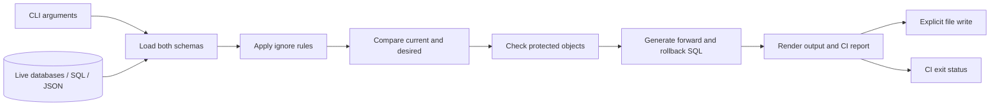

# Architecture

[Back to README](../README.md) · [CLI guide](cli.md) · [Contributing](../CONTRIBUTING.md)

## Comparison pipeline

The pipeline produces a plan. It does not execute the generated migration SQL against a database. `--emit` or `--out --write` saves the plan; `--ci` controls the final drift/blocking exit status.

## Module map

| Module | Responsibility |
| --- | --- |
| [`src/main.rs`](../src/main.rs) | Dispatch commands |
| [`src/cli.rs`](../src/cli.rs) | Parse arguments, apply profiles, normalize diff parameters |
| [`src/commands/`](../src/commands/) | Orchestrate diff, snapshot, validate, tables, and init |
| [`src/model.rs`](../src/model.rs) | Canonical schema model and JSON snapshots |
| [`src/loader/`](../src/loader/) | Load PostgreSQL, MySQL/MariaDB, SQLite, SQL files, or snapshots |
| [`src/config/`](../src/config/) | Read config and apply ignore rules |
| [`src/diff.rs`](../src/diff.rs) | Compare schemas, including optional rename inference |
| [`src/migration/`](../src/migration/) | Generate forward/rollback statements and dialect-specific SQL |
| [`src/output.rs`](../src/output.rs) | Pretty output, explanations, SQL rendering |
| [`src/ci.rs`](../src/ci.rs) | Structured reports, blocking classification, annotations, exit codes |
| [`src/error.rs`](../src/error.rs) | Error representation and DSN sanitization helpers |

## Schema model and sources

`Schema` stores tables, views, enums, and sequences. Tables contain columns, indexes, and constraints. `BTreeMap` collections provide deterministic ordering. Loaders convert supported sources into this common representation; database backends are Cargo features.

The comparison engine produces a `SchemaDiff`, including added/removed objects, modified tables and columns, and optional rename candidates. SQL generation uses the selected backend dialect.

A `.sql` file supplies the structure parsed from CREATE statements. The parser does not load views, enums, or sequences, so the diff command excludes these object categories when either side is a SQL file. JSON snapshots retain them and can be compared offline.

Two SQL files or snapshots use PostgreSQL-style migration SQL. A live backend paired with a SQL file/snapshot selects that live backend's dialect. Mixed live backends are rejected.

## Verification

- Unit tests exercise parsing, the schema model, comparison, migration generation, reports, and configuration.
- [`tests/`](../tests/) exercises CLI behavior, configuration, and constraints with checked-in fixtures.
- [`examples/demo/run.py`](../examples/demo/run.py) verifies the public demo's JSON changes, CI exit codes, preview behavior, saved SQL, and rollback output.

These checks run without live database credentials. Backend changes also need targeted manual checks against disposable databases for behavior that fixtures cannot represent.

## Extending a backend

1. Add a loader that produces the shared schema representation.
2. Add source dispatch and Cargo feature gating.
3. Implement the backend's SQL dialect, supported DDL, and warnings.
4. Add loader, comparison, and migration tests relevant to that backend.
5. Update capabilities and CLI examples to reflect the verified behavior.

Do not assume a new backend can execute another backend's migration SQL unchanged.
