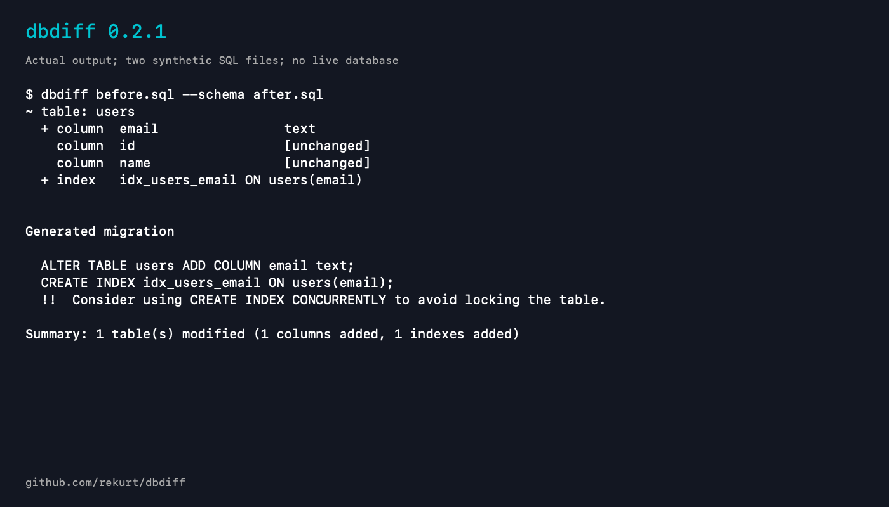

# dbdiff command-line example

Version: `dbdiff 0.2.1`. This is actual captured command output rendered into a static PNG, not a TUI screenshot or a new recording.

The input files are synthetic SQL schemas. The example adds one email column and an index. No live database is contacted and no migration is executed. Generated SQL requires review for the target database and its locking behavior.

[Plain-text transcript](schema-diff-demo.txt)

The preview and accompanying documentation were prepared with AI assistance.
